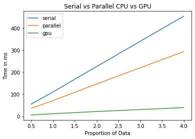
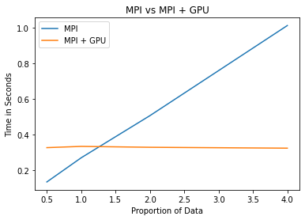

# CS5030 Final Project - The Genre Reveal Party
## Carter Bailey, Gavin Eddington, Trey Crowther

***

Program to compute the K-mean clustering algorithm to cluster songs using metrics provided by Spotify. Includes a serial and four parallel implementations:

* Serial
* Parallel shared memory CPU
* Parallel shared memory GPU
* Distributed memory CPU
* Distributed memory GPU

## The Problem

K-Means clustering is a type of unsupervised learning where the main goal is to find groups in data. It is an iterative technique where each point is assigned to one of the K groups based on their feature similarity.

### A general outline of the algorithm:

1. Pick K points as the initial centroids (ours is done randomly).
2. Find the distance (we use Euclidean) of each point with the K points (Centroids).

&nbsp;&nbsp;&nbsp;&nbsp;&nbsp;&nbsp;&nbsp;&nbsp;&nbsp;&nbsp;&nbsp;&nbsp;&nbsp;&nbsp;&nbsp;&nbsp;

3. Assign each point to the closest Centroid.

&nbsp;&nbsp;&nbsp;&nbsp;&nbsp;&nbsp;&nbsp;&nbsp;&nbsp;&nbsp;&nbsp;&nbsp;&nbsp;&nbsp;&nbsp;&nbsp;

4. Find new centroids by taking the average of each cluster.

&nbsp;&nbsp;&nbsp;&nbsp;&nbsp;&nbsp;&nbsp;&nbsp;&nbsp;&nbsp;&nbsp;&nbsp;&nbsp;&nbsp;&nbsp;&nbsp;
 

where S is points in the clusters

5. Repeat steps 2-4.

#### NOTE
  We discovered that if the data wasn't standardized then tempo became the dominant selector for where songs were clustered. To remediate this issue we standardized the data.

### Outline of each implementation version

#### OpenMP
  For this implementation two openmp for loops were utilized to parallelize the song assignment to cluster and averaging of cluster location. A MPCritical section was used when writing songs to their designated cluster to prevent race condition.

### CUDA
  Steps 2-4 in the general outline above were done on a per thread basis. Where the GPU would compute that portion of the program, call a CUDAsynchronize and then start the next portion. This led to dramatically increased speeds compared to the serial version. 

### OpenMPI
  The data was distributed equally among the processors, the process for finding centroids was then performed on each processor. Once the computations were done the results were sent back to rank 0 to create new centroids which were then sent back out to all processors for the next round. 

### OpenMPI + CUDA
  The data was distributed equally among the processors, at which point a modified version of the above cuda implementation was invoked on each processor. Once the GPU computations were done the results were sent back to rank 0 to create new centroids which were then sent back out to all processors for the next round. 
  
## Compilation instructions

### **Serial**

Required modules: `$module load cmake`

Compile: `$cmake .` `$make`

Run: `$./serial <amount of centroids>`

### **Shared CPU**
(uses the same cmake file as serial)

Required modules: `$module load cmake`

Compile: `$cmake .` `$make`

Run: `$./openmp <amount of centroids> <amount of threads>`

### **Shared GPU**

Required modules: `module load cuda`

Compile: `nvcc gpu.cu -o main`

Run: `./main`

### **Distributed CPU**
Required modules: 
  `module load gcc/8.5.0`
  `module load intel-mpi`

Compile: `mpicxx -o mpi MPI.cpp`

Run: `mpiexec -n <number of processes> ./mpi <amount of centroids>`

### **Distributed GPU**
Required modules: 
  `module load gcc/8.5.0`
  `module load mvapich2 cuda`

Compile: `mpicxx -c MPIandCuda.cpp -o main.o; nvcc -c MPIandCuda.cu -o gpu_main.o; mpicxx main.o gpu_main.o -lcudart;`

Run: `mpiexec -n <number of processes> ./a.out <amount of centroids>`

## Verification

To verify that the various versions are creating the same centroids run verifier.py. This script checks to make sure that the same amount of songs are assigned to each cluster, using the serial results as the baseline.

This can be done by typing `python3 verifier.py` into the command line.

Note that this file requires pandas which is not on the hpc clusters so you have to copy over the results.csv's onto your own computer to run verifier.py. 

## Visualization

A .ipynb file titled `visualization.ipynb` is provided for visualizing the cluster assignments in three dimensions as was asked by Dr. Petruzza. To run this notebook load it into jupyter notebook and run the cells.

It will create one image for each version of the kmeans algorithm that was created. This image is a scatterplot, that is color coded based on the centroid assignment for the songs. 

The x,y, and z variables that are used in the graphs can be changed individually to allow for more images to be made. 

## Scaling Study

**NOTE** 
In the graphs directory there are images that correlate with all of our scaling studies.

### Serial
  With the serial implementation we found that as data increased the amount of time to compute also increased linearly. 

### Parallel shared memory CPU
  With the parallel implementation we found that as more processes are added we see a slowdown in the system. This is most likely due to the critical section that every thread has to write to. 
  Even with these slow downs the parallel implementation was faster than the serial by X amount

### Parallel shared memory GPU
  With the Parallel shared memory GPU we saw as the grid block dimensions were increased the computation time became very similar. This is most likely due to the grid blocks becoming big enough that each thread only had to compute one result. Once each thread was only having to do one result the amount of time that can be decreased is diminished.

### Distributed memory CPU
  The distributed memory CPU performed worse than the serial implemntation when tested. We did see speedups as the amount of processors increased but due to our data size being small the benefits that come from spreading the data out among different processes weren't seen. Instead we saw the disadvantages of MPI where the sending and receiving of data slowed down our implementation. If we had tested with a much larger amount of processors or had more data to test on then the distributed memory CPU would most liekely have performed better.

### Distributed memory GPU
  For the Distributed memory GPU we always had a block size of 64 since that was where our speeds capped on the GPU version. With this implementation, we found that the time it took to calculate the results for each data size was around the same time. We believe this is because the GPU's were able to calculate their results quickly and the bottleneck occured at the MPI communication which resulted in the normal file size and the four times bigger file having similar compute times. Like the distributed memory cpu we believe we would start to see actual speed ups if the data size was drastically bigger. Sadly the bigger file size that Dr. Petruzza had sent out was in a different format than the previous one he had provided and didn't work with our implementation.

### Serial Vs. Parallel CPU Vs. Parallel GPU
The serial version performed the slowest, this was due to only having one thread running. The CPU and GPU versions both saw significant speedup. The GPU version performed the best due to it's high amount of threads being used. The CPU version still saw a speedup but this was hindered due to the critical section in one of the for loops causing all the threads to have to wait on each other. 

&nbsp;&nbsp;&nbsp;&nbsp;&nbsp;&nbsp;&nbsp;&nbsp;&nbsp;&nbsp;&nbsp;&nbsp;&nbsp;&nbsp;&nbsp;&nbsp;
### Distributed CPU Vs. Distributed GPU
  The GPU version was significantly faster than the CPU version. This was due to the Speedup of using the parallel benefits of the GPU to compute the centroids, whereas the cpu version was computing them serially just on different processors. 
  Both versions saw a slowdown with having to send and recieve data back and forth. With a larger dataset the advantages of both of these implementations would have been more realized. 
&nbsp;&nbsp;&nbsp;&nbsp;&nbsp;&nbsp;&nbsp;&nbsp;&nbsp;&nbsp;&nbsp;&nbsp;&nbsp;&nbsp;&nbsp;&nbsp;
